# Epi4Ab Deep Dive: Model Architecture, Training, and Prediction

**Complete technical documentation of the Epi4Ab epitope prediction model**

---

## Table of Contents

1. [Complete Architecture Overview](#complete-architecture-overview)
2. [Layer-by-Layer Breakdown](#layer-by-layer-breakdown)
3. [Feature Fusion: Sequence + Structure](#feature-fusion-sequence--structure)
4. [Model Layers and Attention Mechanisms](#model-layers-and-attention-mechanisms)
5. [Training Procedure](#training-procedure)
6. [Loss Functions](#loss-functions)
7. [Prediction Mechanism](#prediction-mechanism)
8. [Data Flow Through the Model](#data-flow-through-the-model)

---

## Complete Architecture Overview

### Big Picture: Full Model Architecture

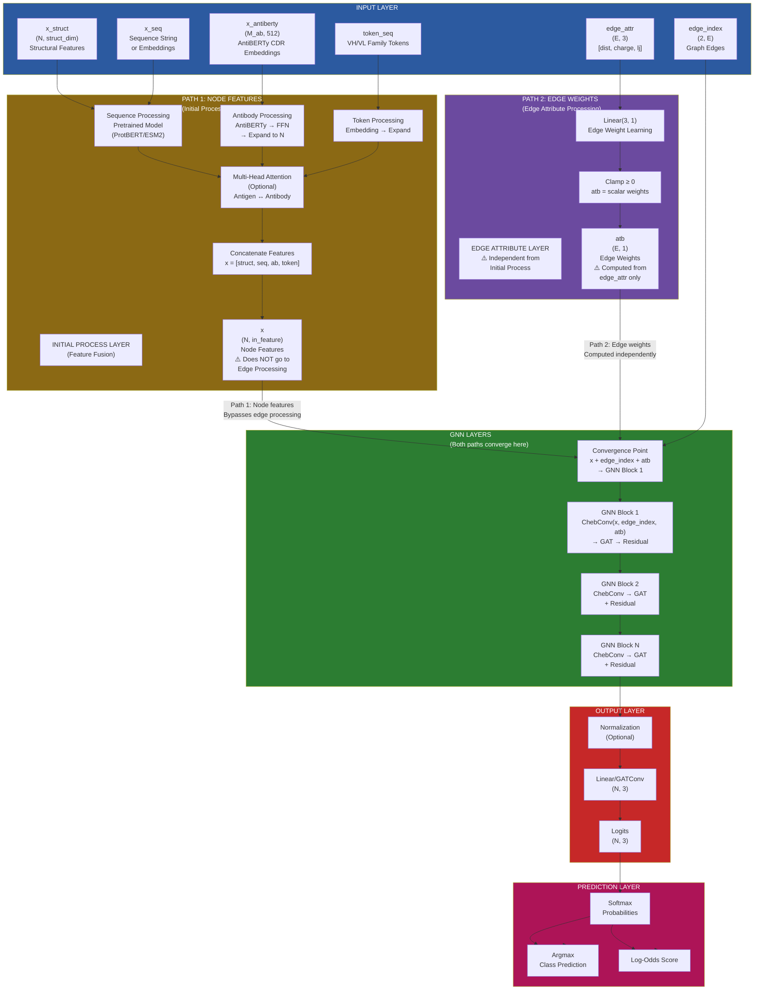

### Layer Dimensions Flow

```mermaid
graph LR
    A["Input<br/>x_struct: (N, struct_dim)<br/>x_seq: (N, seq_dim)<br/>x_ab: (M_ab, 512)<br/>token: (N, token_dim)"] 
    --> B["InitialProcess<br/>Concatenate + MHA<br/>Output: (N, in_feature)"]
    B --> C["Edge Processing<br/>edge_attr: (E, 3)<br/>→ atb: (E, 1)"]
    C --> D["GNN Block 1<br/>Input: (N, in_feature)<br/>Output: (N, hidden_1)"]
    D --> E["GNN Block 2<br/>Input: (N, hidden_1)<br/>Output: (N, hidden_2)"]
    E --> F["...<br/>GNN Block N"]
    F --> G["Output Layer<br/>Input: (N, hidden_N)<br/>Output: (N, 3)"]
    G --> H["Prediction<br/>Classes: 0, 1, 2<br/>Probabilities: (N, 3)"]

    style A fill:#2c5aa0,color:#fff
    style B fill:#8b6914,color:#fff
    style C fill:#6b4a9f,color:#fff
    style D fill:#2c7d32,color:#fff
    style E fill:#2c7d32,color:#fff
    style F fill:#2c7d32,color:#fff
    style G fill:#c62828,color:#fff
    style H fill:#ad1457,color:#fff
```

**Key Dimensions**:
- **N**: Number of antigen residues (varies per PDB, typically 50-500)
- **E**: Number of edges (varies per PDB, typically 500-5000)
- **M_ab**: Total antibody CDR length (sum of H1+H2+H3+L1+L2+L3, typically 50-100)
- **in_feature**: Combined input dimension (struct_dim + seq_dim + ab_dim + token_dim)
- **hidden_i**: Hidden layer dimensions (configurable, typically 64-512)
- **out_label**: 3 (classes: 0=non-epitope, 1=CIPS, 2=BepiPred)

---

## Multi-Head Attention (MHA): Complete Guide

### Current Configuration

**✅ Currently Active Mode: Mode 2 (`use_mha_on='seq'`)**

From the trained model configuration (`final_trained_Epi4Ab/log.json`):
- `use_mha_on`: `"seq"` ← **Mode 2 is active**
- `use_token`: `false` ← Token features are **disabled**
- `use_antiberty`: `true` ← AntiBERTy is **enabled**
- `use_struct`: `true` ← Structural features are **enabled**
- `use_pretrained`: `true` ← Sequence embeddings are **enabled**
- `in_feature`: `687` ← Final input dimension
- `mha_head`: `4` ← 4 attention heads
- `mha_num_layers`: `6` ← 6 stacked MHA layers

**Active Features in Current Model**:
- ✅ Structural features (x_struct)
- ✅ Sequence embeddings (x_seq from ESM2_t30)
- ✅ AntiBERTy embeddings (x_antiberty from CDR sequences)
- ❌ Token features (disabled)

### What is Multi-Head Attention?

**⚠️ Critical Understanding**: MHA operates on **FEATURE VECTORS (embeddings)**, NOT raw strings

**Purpose**: Model antigen-antibody interactions by allowing antigen residues to "attend to" antibody CDR regions

**Mechanism**:
- **Query**: Antigen feature vectors (what we're looking for)
- **Key/Value**: Antibody feature vectors (what we're attending to)
- **Output**: Antigen features enriched with antibody context

**Custom Implementation**: Uses PyTorch's `nn.MultiheadAttention` - feature vector attention, NOT string-to-string token attention

### Three MHA Modes: Detailed Flow

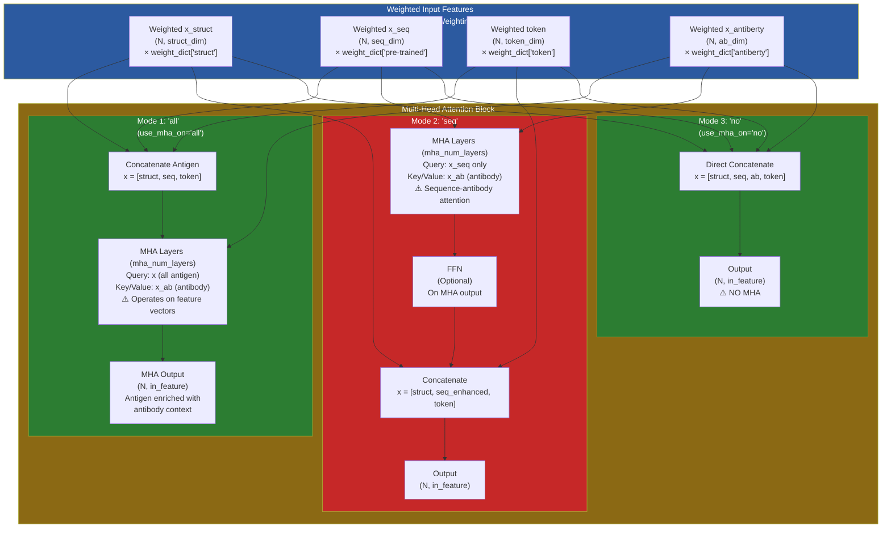

### Mode-by-Mode Explanation

#### Mode 1: MHA on All Features (`use_mha_on='all'`)

**Intuition**: Create unified multi-modal antigen representation, then attend to antibody

**Flow**:
1. Weight all features: `x_struct`, `x_seq`, `token` → weighted
2. Concatenate: `x = [x_struct, x_seq, token]` → unified antigen representation
3. MHA: Query = `x` (all antigen features), Key/Value = `x_antiberty` (antibody)
4. Output: Antigen features enriched with antibody context

**⚠️ Note on Permutation Invariance**: You're right that MHA is permutation invariant. In Mode 1, concatenating structural features (which have spatial meaning) with sequence features before MHA may not fully respect spatial structure. This is why Mode 2 (current) applies MHA only to sequence features, then combines with structure afterward.

**When to Use**: When you want all antigen information (structure + sequence + tokens) to interact with antibody simultaneously

#### Mode 2: MHA on Sequence Only (`use_mha_on='seq'`) ← **CURRENT**

**Intuition**: Let sequence-antibody interaction happen first, then add structural context

**Flow**:
1. Weight all features
2. MHA: Query = `x_seq` (sequence only), Key/Value = `x_antiberty` (antibody)
3. Optional FFN on MHA output
4. Concatenate: `x = [x_struct, seq_enhanced, token]` → combine with structure

**Why This Design?**:
- Sequence embeddings (ESM2/ProtBERT) already encode rich protein information
- Structural features are more "static" (3D properties)
- **Hypothesis**: Sequence-antibody interaction is more informative than structure-antibody
- Avoids permutation invariance issue by keeping structure separate from MHA

**Token Role**: Token features are **separate** - they balance VH/VL family importance. They don't go through MHA in this mode, they're added after to provide family context.

**When to Use**: When sequence patterns are more important than structural features for antibody binding (current model uses this)

#### Mode 3: No MHA (`use_mha_on='no'`)

**Intuition**: Direct feature combination without attention

**Flow**:
1. Weight all features
2. Direct concatenation: `x = [x_struct, x_seq, x_antiberty, token]`
3. No MHA - simple feature combination

**When to Use**: When you want to rely on GNN layers to learn interactions, not MHA

### Feature Weighting: Always Applied First

**✅ Status: ALWAYS ON** - All features are weighted before MHA/concatenation

**What Weighting Does**:
- **Scalar Multiplication**: Each feature is multiplied by a scalar weight (e.g., 0.5, 1.0, 2.0)
- **Purpose**: Balance the relative importance of different feature types
- **Effect**: 
  - Weight > 1.0: Feature is emphasized
  - Weight = 1.0: Feature unchanged
  - Weight < 1.0: Feature is suppressed

**Weighting Flow**:
```python
# x_struct weighting (ALWAYS applied)
x_struct = x_struct * weight_dict['struct']

# x_seq weighting (ALWAYS applied after embedding)
x_seq = x_seq * weight_dict['pre-trained']

# x_antiberty weighting (ALWAYS applied)
x_antiberty = x_antiberty * weight_dict['antiberty']

# token weighting (ALWAYS applied)
token_feature = token_feature * weight_dict['token']
```

**Why Weighting Before MHA?**
- Weighting controls feature importance **before** attention computation
- MHA then learns which antigen residues attend to which antibody regions
- Weighted features ensure balanced representation in attention queries/keys

### Dimension Differences Across Modes

**If token is disabled** (current model), the three modes have different dimensions:

| Mode | MHA Query Dimension | Final Output Dimension |
|------|---------------------|------------------------|
| **Mode 1 ('all')** | `struct_dim + seq_dim` (if token disabled) | MHA output: `(N, struct_dim + seq_dim)` |
| **Mode 2 ('seq')** ← **Current** | `seq_dim` only (640 for ESM2_t30) | `struct_dim + seq_dim` (687) |
| **Mode 3 ('no')** | N/A (no MHA) | `struct_dim + seq_dim + ab_dim` |

**Current Model Dimensions**:
- `in_feature`: 687
- Breakdown: `struct_dim (~47) + seq_dim (640) + ab_dim (~16)` = ~703 (close to 687)

### AntiBERTy: CDR-Specific Embeddings

**Yes, AntiBERTy is specifically for converting CDR strings to embeddings**:
- **Input**: CDR sequence strings (H1, H2, H3, L1, L2, L3)
- **Process**: AntiBERTy model (trained on antibody sequences) → Embeddings (512-dim)
- **Purpose**: Capture antibody-specific patterns that general protein models (ESM2/ProtBERT) might miss
- **Why separate?**: Antibodies have unique sequence patterns (CDR loops, framework regions) that benefit from specialized embeddings

---

## Layer-by-Layer Breakdown

### Layer 1: Input Layer → Initial Process Layer

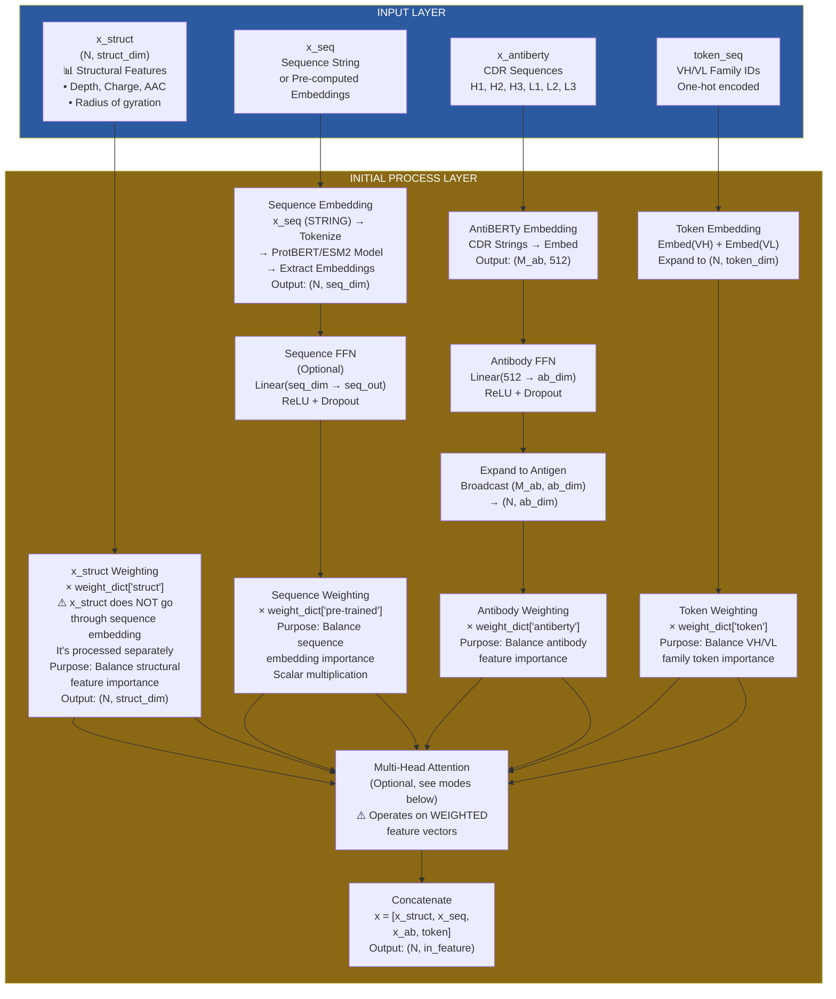


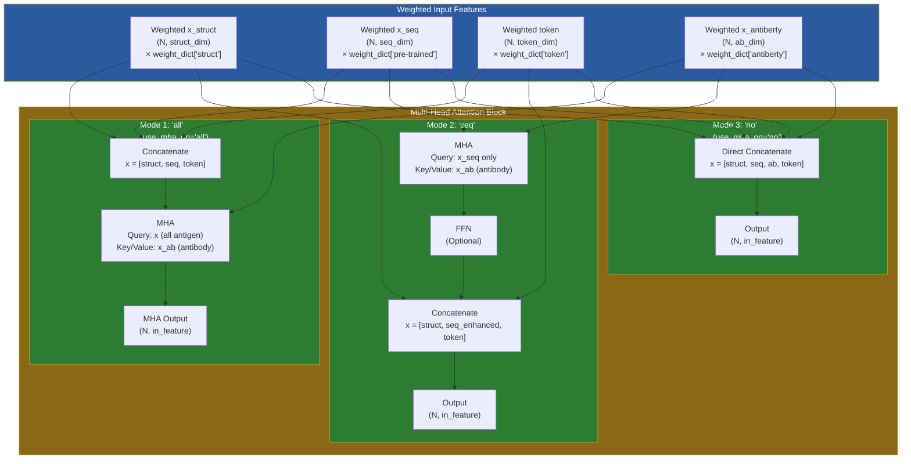

**Connection Explanation**:

### Feature Processing Flow

1. **x_seq (Sequence Features) - Pure Sequence → Embedding → Weighting → MHA**: (I personally think this makes no sense because MHA is permuatation invariant so putting structural data here makes no sense)
   - **Step 1**: Raw sequence STRING → Tokenize → Pretrained model (ProtBERT/ESM2) → Extract embeddings `(N, seq_dim)`
   - **Step 2**: Optional FFN: `Linear(seq_dim → seq_out)` with ReLU + Dropout
   - **Step 3**: **Weighting**: `x_seq = x_seq * weight_dict['pre-trained']` (scalar multiplication)
     - **Purpose**: Balance the importance of sequence embeddings relative to other features
     - **Effect**: If weight is high, sequence features dominate; if low, they're suppressed
   - **Step 4**: Weighted sequence features go to MHA (if enabled) or direct concatenation

2. **x_struct (Structural Features)**:
   - ⚠️ **Does NOT go through sequence embedding** - it's processed separately
   - **Weighting**: `x_struct = x_struct * weight_dict['struct']` (scalar multiplication)
     - **Purpose**: Balance structural feature importance (depth, charge, AAC, etc.)
     - **Effect**: Controls how much structural information contributes vs sequence/antibody features
   - Remains as `(N, struct_dim)` - no transformation, only weighting

3. **x_antiberty (Antibody Features)**:
   - CDR sequence STRINGS → AntiBERTy embedding → FFN → Expand to `(N, ab_dim)`
   - **Weighting**: `x_antiberty = x_antiberty * weight_dict['antiberty']`
     - **Purpose**: Balance antibody feature importance
     - **Effect**: Controls antibody-antigen interaction strength in the model

4. **token_seq (Token Features)**:
   - VH/VL family IDs → Embedding → Expand to `(N, token_dim)`
   - **Weighting**: `token_feature = token_feature * weight_dict['token']`
     - **Purpose**: Balance VH/VL family token importance
     - **Effect**: Controls how much antibody family information contributes


---

### Layer 2: Initial Process → Edge Attribute Processing

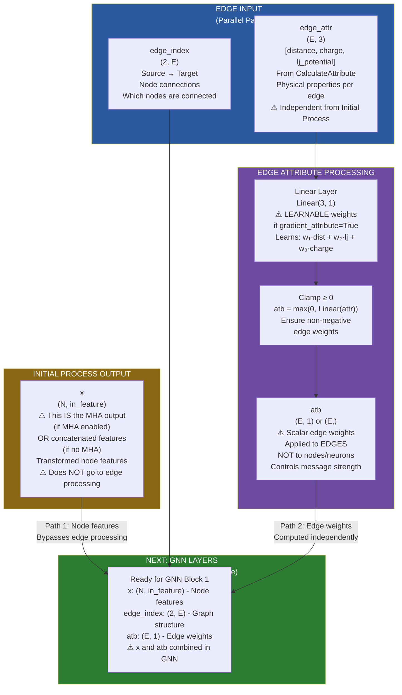

**Connection Explanation**:

### Initial Process Output: What is `x`?

**Flow: Embeddings → Node Features**

**Step 1: Create Embeddings** (intermediate steps):
- **Sequence embeddings**: Raw sequence strings → Tokenize → Pretrained model (ProtBERT/ESM2) → `x_seq` embeddings `(N, seq_dim)`
- **Antibody embeddings**: CDR strings → AntiBERTy → `x_antiberty` embeddings `(M_ab, 512)` → Expand to `(N, ab_dim)`
- **Token embeddings**: VH/VL family IDs → Embedding layers → `token_feature` `(N, token_dim)`
- **Structural features**: Already processed → `x_struct` `(N, struct_dim)` (no embedding needed)

**Step 2: Combine Embeddings into Node Features** (final output):
- **If MHA is enabled** (Mode 1 or Mode 2):
  - Embeddings go through Multi-Head Attention → enriched with antibody context
  - Then concatenated → `x = [struct, seq_enhanced, token]` or MHA output
- **If MHA is disabled** (Mode 3):
  - Direct concatenation → `x = [struct, seq, ab, token]`

**Result: `x` = Final Node Features** `(N, in_feature)`
- **Yes, embeddings are inputs into creating node features** - they are combined/processed to form `x`
- `x` contains the final representation for each node (residue) that will be used in GNN layers
- Each row of `x` represents one residue/node with all its features (sequence, structure, antibody context, etc.)

**Current Model** (Mode 2, `use_mha_on='seq'`):
- Sequence embeddings (`x_seq`) go through MHA → enriched with antibody context
- Then: `x = [struct, seq_enhanced, token]` (concatenated)
- **This `x` is the final node feature representation** `(N, in_feature)` that goes to GNN layers

**What "passes through unchanged" means**:
- The Initial Process output `x` is passed to GNN layers **without further transformation**
- But `x` itself IS created from embeddings (by MHA or concatenation)
- The phrase means: "No additional processing between Initial Process and GNN" - `x` is ready to use

### Edge Attribute Processing: Computing `atb`

**Purpose**: Convert raw edge attributes into scalar edge weights `atb` that will be used in GNN blocks.

**Why Edge Attributes, Not Node Attributes?**

Physical forces like distance and attraction only exist **between two objects**, so they must live on the **connection (the edge)**, not inside the **object (the node)**. 

- **Distance**: Exists between residue pairs, not within a single residue
- **Charge interactions**: Electrostatic forces occur between charged residues
- **Lennard-Jones potential**: Van der Waals interactions happen between atom pairs

Therefore, edge attributes (distance, charge product, LJ potential) are computed **per edge** and stored as `atb` weights that control how strongly information flows along each connection during message passing in the GNN.

**Input**: `edge_attr` `(E, 3)` - [distance, charge, lj_potential] per edge  
**Output**: `atb` `(E, 1)` - scalar weight per edge

**Two Computation Modes**:

1. **Learnable (`gradient_attribute=True`)**:
   ```python
   # Learnable Linear layer: Linear(3, 1)
   attribute_layer = nn.Linear(3, 1, bias=optional_bias)
   # This is a TRAINABLE layer - weights can be updated
   
   # During forward pass:
   atb = attribute_layer(edgeAttribute).clamp(0)
   # atb = w₁·distance + w₂·lj_potential + w₃·charge
   #      ↑              ↑                ↑
   #   Learned      Learned          Learned
   #   weights      weights          weights
   ```
   - **Learnable**: The weights `[w₁, w₂, w₃]` are **trainable parameters**
   - **Backpropagation**: ✅ **YES** - Gradients flow through `attribute_layer` during training
   - **Purpose**: Model learns which edge attributes (distance, LJ potential, charge) are most important
   - **Training**: Weights adjust via backpropagation to optimize epitope prediction
   - **Example**: Model might learn `[0.8, 0.1, 0.1]` meaning distance is most important

2. **Fixed Mode (`gradient_attribute=False`)**:
   ```python
   # Uses pre-computed attribute_weight (NOT learnable)
   # Calculated in CalculateAttribute class
   atb = edgeAttribute @ attribute_weight  # Fixed weights
   # Uses: attribute_weight = [0.17, -0.05, -0.002] (from config)
   ```
   - **Fixed**: Uses `attribute_weight` from config (e.g., `[0.17, -0.05, -0.002]`)
   - **No backpropagation**: ❌ Weights don't change during training
   - **Physical intuition**: Based on chemical/physical properties

**Note**: `atb` is computed here but **applied** in GNN blocks (next layer) during message passing.

---

### Layer 3: Edge Processing → GNN Block 1

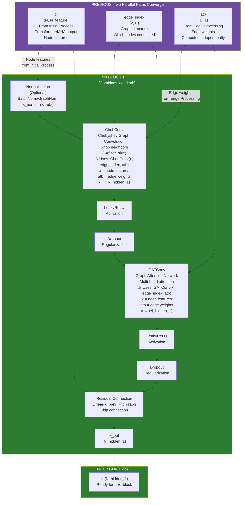

**Connection Explanation**:
- **Input**: Node features `x` from Initial Process, edge indices, and edge weights `atb`
- **Normalization**: Optional normalization (BatchNorm/GraphNorm) stabilizes training
- **ChebConv**: Performs K-hop graph convolution (aggregates information from K-hop neighbors)
  - Uses Chebyshev polynomial approximation for efficient computation
  - **Uses both `x` and `atb`**: `ChebConv(x, edge_index, atb)` ← **`x` is the node features, `atb` controls edge weights**
  - Output dimension: `hidden_1` (first hidden layer size)
- **GATConv**: Graph Attention Network applies attention mechanism
  - Each node learns which neighbors are most important
  - **Uses `atb`**: Edge weights also influence attention computation
  - Multi-head attention captures different types of relationships
- **Residual Connection**: Adds original input (projected via Linear layer) to output
  - **Purpose**: Enables gradient flow and prevents vanishing gradients
  - **Formula**: `x_out = Linear(x_prev) + GAT(ChebConv(x_prev))`
- **Output**: Transformed node features `(N, hidden_1)` passed to next GNN block

### Visual: How `atb` is Applied During Message Passing in GNN

**Graph Visualization**: `atb` weights are applied **ON THE EDGES** (the lines connecting nodes) during graph convolution in the GNN block.

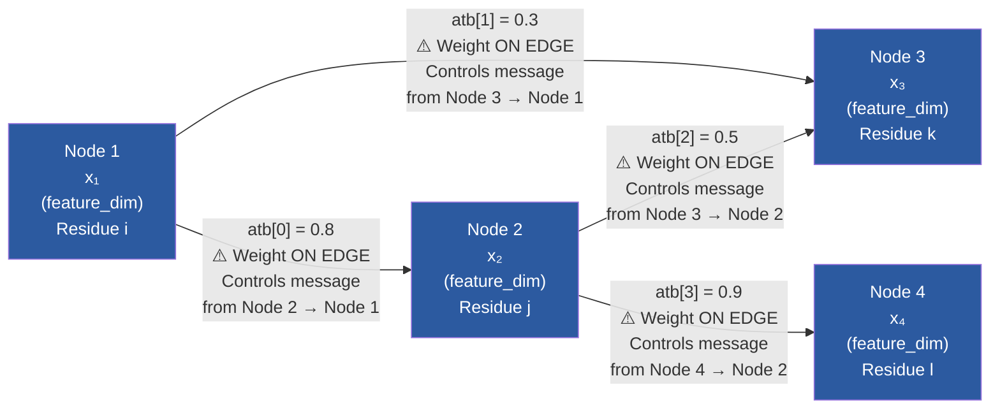

**Message Passing Example** (happens inside ChebConv/GATConv):

When Node 1 aggregates messages from its neighbors (Node 2 and Node 3) during graph convolution:

```
Node 1's new features = 
    0.8 × x₂  (from Node 2, weight atb[0]=0.8)
  + 0.3 × x₃  (from Node 3, weight atb[1]=0.3)
```

**Key Points**:
- ⚠️ **`atb` weights are ON THE EDGES** (the lines), not on the nodes
- Each edge has **one scalar weight** `atb[i]` (computed in Edge Processing layer)
- The weight controls **how much information flows** along that edge during message passing in GNN
- Higher weight (e.g., 0.9) = stronger connection = more information flows
- Lower weight (e.g., 0.3) = weaker connection = less information flows
- **Node features (`x`) are NOT modified by `atb`** - `atb` only controls the aggregation weights

**In Code** (inside ChebConv/GATConv):
```python
# During graph convolution in GNN block:
# For each node i, aggregate messages from neighbors j:
message_i = Σ_j (atb[edge_ij] × x_j)
#              ↑
#         Edge weight controls
#         how much neighbor j
#         contributes to node i
```

**What Happens**:
1. **Edge Processing** (previous layer): Computes `atb` from edge attributes → `atb = Linear(edge_attr).clamp(0)`
2. **GNN Block** (this layer): Uses `atb` during graph convolution → `x_out = ChebConv(x, edge_index, atb)`
3. **Result**: Node features are updated based on weighted messages from neighbors

---

### Layer 4: GNN Block 1 → GNN Block 2 → ... → GNN Block N

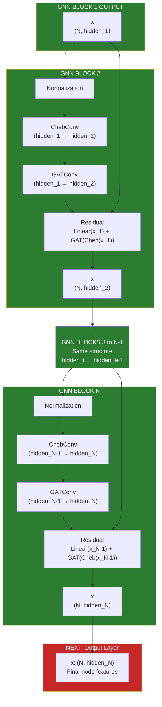

**Connection Explanation**:
- **Stacked GNN Blocks**: Each block processes features sequentially
- **Dimension Flow**: `hidden_1 → hidden_2 → ... → hidden_N`
  - Each block can have different hidden dimensions (configurable)
  - Or all blocks can share same dimension
- **Residual Connections**: Each block maintains skip connection from its input
  - Enables deep networks without vanishing gradients
  - Allows model to learn identity mappings when needed
- **Progressive Feature Refinement**:
  - Early blocks: Capture local structural patterns
  - Middle blocks: Aggregate information from wider neighborhoods
  - Late blocks: Integrate global context
- **Deep-Shallow Option**: In later blocks (if `use_deep_shallow=True`), only surface residues are connected
  - Focuses computation on epitope-relevant regions
- **Output**: Final node features `(N, hidden_N)` ready for classification

---

### Layer 5: GNN Blocks → Output Layer

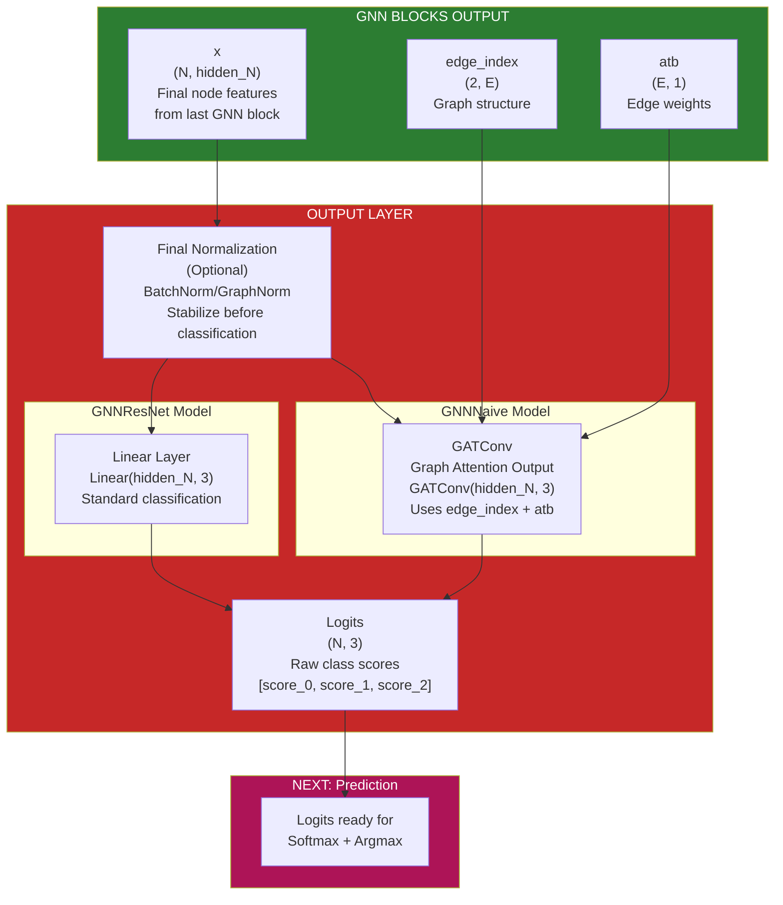

**Connection Explanation**:
- **Input**: Final node features from last GNN block `(N, hidden_N)`
- **Final Normalization**: Optional normalization before classification (stabilizes outputs)
- **Two Output Strategies**:
  - **GNNNaive**: Uses GATConv for final classification (maintains graph structure)
  - **GNNResNet**: Uses Linear layer (simpler, faster)
- **Output Dimension**: `(N, 3)` - one score per class per residue
  - Class 0: Non-epitope score
  - Class 1: CIPS contact score
  - Class 2: BepiPred predicted score
- **Logits**: Raw unnormalized scores (not probabilities yet)
- **Next Layer**: Logits go to prediction layer for softmax and class assignment

---

### Layer 6: Output Layer → Prediction Layer

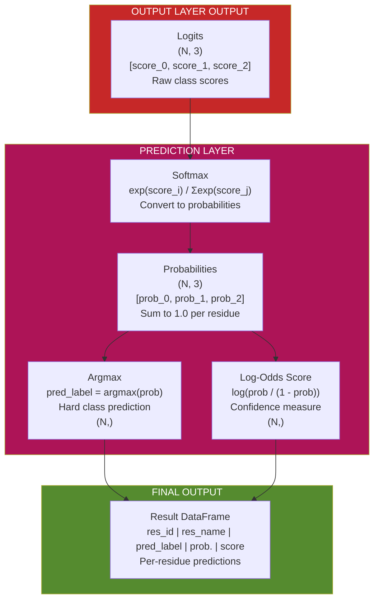

**Connection Explanation**:
- **Input**: Raw logits `(N, 3)` from output layer
- **Softmax**: Converts logits to probabilities
  - Each residue gets probability distribution over 3 classes
  - Probabilities sum to 1.0 for each residue
  - Formula: `prob_i = exp(logit_i) / Σ_j exp(logit_j)`
- **Argmax**: Selects class with highest probability
  - Hard prediction: `pred_label = argmax(prob)`
  - Values: 0, 1, or 2
- **Log-Odds Score**: Calculates confidence measure
  - Higher score = more confident prediction
  - Formula: `score = log(prob_pred / (1 - prob_pred))`
- **Output**: Final predictions per residue
  - `res_id`: Residue identifier
  - `res_name`: Amino acid code
  - `pred_label`: Predicted class (0, 1, or 2)
  - `prob.`: Probability of predicted class
  - `score`: Log-odds confidence score

---

## Feature Fusion: Sequence + Structure

### Input Features

The model accepts **four types of input features**:

#### 1. Structural Features (`x_struct`)
- **Source**: `node_feature.parquet` (preprocessed structural features)
- **Features Include**:
  - Residue depth (solvent accessibility)
  - Charge composition
  - Amino acid composition (AAC)
  - Radius of gyration
  - Other structural properties
- **Processing**: 
  - Optional softmax normalization
  - Weighted by `initial_process_weight_dict['struct']`

#### 2. Sequence Features (`x_seq`)
- **Source**: Pretrained protein language models
- **Options**:
  - **ProtBERT**: `Rostlab/prot_bert`
  - **ESM2 variants**: `facebook/esm2_t6_8M_UR50D`, `esm2_t12_35M_UR50D`, `esm2_t30_150M_UR50D`, `esm2_t33_650M_UR50D`, `esm2_t36_3B_UR50D`
- **Processing**:
  - Tokenize sequence → Pretrained model → Extract embeddings
  - Optional feed-forward network: `Linear(seq_ff_in → seq_ff_dim → seq_out)`
  - Weighted by `initial_process_weight_dict['pre-trained']`

#### 3. Antibody Features (`x_antiberty`)
- **Source**: AntiBERTy embeddings of CDR sequences
- **CDRs**: H1, H2, H3, L1, L2, L3
- **Processing**:
  - Embed each CDR → Pad to `antiberty_max_len`
  - Feed-forward: `Linear(antiberty_ff_in → antiberty_ff_dim → antiberty_ff_out)`
  - Expand to match antigen length (broadcast to each residue)
  - Weighted by `initial_process_weight_dict['antiberty']`

#### 4. Token Features (`token_seq`)
- **Source**: One-hot encoded VH/VL family tokens
- **Processing**:
  - Embed VH family: `Embedding(vh_token_size, token_dim)`
  - Embed VL family: `Embedding(vl_token_size, token_dim)`
  - Concatenate and expand to match antigen length
  - Weighted by `initial_process_weight_dict['token']`

**Location**: `source_code/model/model_class/initial_process.py`

**Feature Fusion Modes**: See the comprehensive "Multi-Head Attention (MHA): Complete Guide" section at the start of this document for complete details on all three modes, feature weighting, and implementation.

---

## Model Layers and Attention Mechanisms

### Graph Structure

**Nodes**: Antigen residues (one node per residue)  
**Edges**: Spatial proximity (from `edge_index.parquet`)  
**Edge Attributes**: 
- Distance (`edge_attribute_dist.parquet`)
- Charge product (`edge_attribute_charge.parquet`)
- Combined via `CalculateAttribute` → 3D vector `[dist, charge, lj_potential]`

### GNN Block Architecture

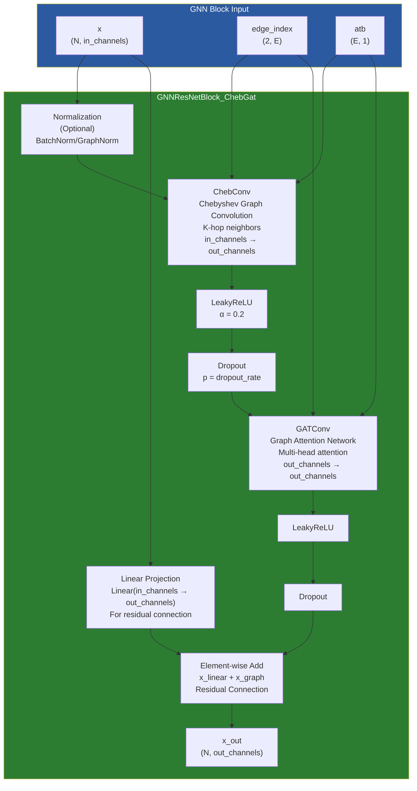

**Location**: `source_code/model/model_class/graph_block.py`

**Key Components**:
- **ChebConv**: Chebyshev polynomial graph convolution (K-hop neighbors)
- **GATConv**: Graph Attention Network (learns attention weights between neighbors)
- **Residual Connection**: `x_out = Linear(x_prev) + GAT(ChebConv(x_prev))`

### Attention Mechanisms

#### 1. Graph Attention (GAT) in GNN Blocks

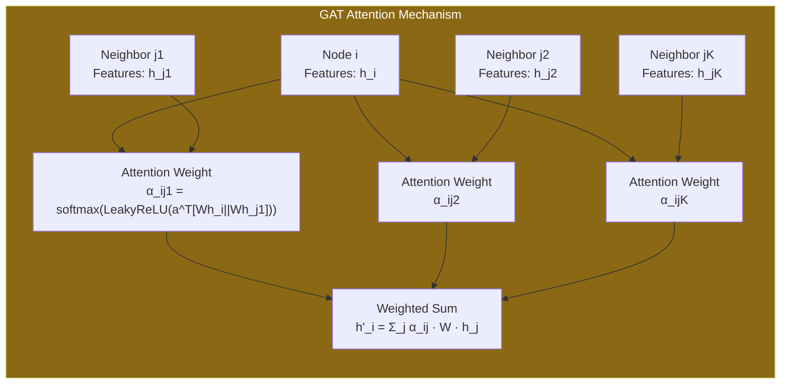

**Purpose**: Learn which neighboring residues are most important

**Mechanism**:
- **Query**: Current node features
- **Key/Value**: Neighbor node features
- **Attention Weights**: Learned from edge attributes (distance, charge)

**Implementation**: `GATConv` from PyTorch Geometric
- Multi-head attention (configurable `attention_head`)
- Concatenation option (`gat_concat=True/False`)

#### 2. Multi-Head Attention (MHA) in InitialProcess

**Note**: For complete details on MHA, see the "Multi-Head Attention (MHA): Complete Guide" section at the start of this document.

**Key Points**:
- MHA operates on **FEATURE VECTORS (embeddings)**, NOT raw strings
- Uses PyTorch's `nn.MultiheadAttention` - feature vector attention
- Stacked MHA layers (`mha_num_layers`) - currently 6 layers
- Query: Antigen features, Key/Value: Antibody features (AntiBERTy embeddings)
- Output: Antigen features enriched with antibody context

### Deep-Shallow Architecture

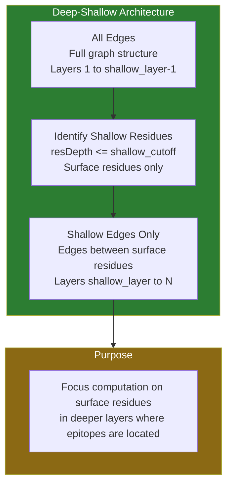

**Optional Feature**: `use_deep_shallow=True`

**Concept**: Use different graph structures for different layers

**Implementation**:
```python
# Identify shallow residues (surface residues)
shallow_index = torch.where(x_struct[:, resDepth_index] <= shallow_cutoff)[0]

# For layers >= shallow_layer, use only shallow edges
if ind >= self.shallow_layer:
    edge_index = edge_shallow  # Only edges between shallow residues
    edge_attribute = atb_shallow
else:
    edge_index = edgeIndex  # All edges
```

**Purpose**: Focus on surface residues in deeper layers (where epitopes are)

---

## Training Procedure

### Training Loop

**Location**: `source_code/model/training_function.py`

**Process**:
```python
for epoch in range(epoch_number):
    # Training phase
    model.train()
    for batch in train_loader:
        optimizer.zero_grad()
        
        # Forward pass
        out = model(x_struct, x_seq, edge_index, edge_attr, 
                   x_antiberty, ab_padding_mask, token_seq, node_size)
        
        # Compute loss
        loss = loss_function(out, y)
        
        # Backward pass
        loss.backward()
        optimizer.step()
    
    # Validation phase (if enabled)
    if train_all == 'with_validation':
        model.eval()
        with torch.no_grad():
            for batch in validate_loader:
                out = model(...)
                loss = loss_function(out, y)
```

### Training Modes

#### 1. Train All (`train_all='yes'`)
- Train on entire dataset
- No validation split
- Used for final model training

#### 2. Train with Validation (`train_all='with_validation'`)
- 90/10 train/validation split
- Validation after each epoch
- Early stopping possible

#### 3. K-Fold Cross-Validation (`train_all='no'`)
- K-fold cross-validation (default K=5)
- Train K models, one per fold
- Average evaluation metrics

### Data Augmentation

**Relaxed Structures**: `use_relaxed=True`
- Include relaxed (unbound) structures
- Helps model generalize

**AlphaFold Structures**: `use_alphafold=True`
- Include AlphaFold-predicted structures
- Expands training data

### Edge Dropout

**Regularization**: `dropout_edge_p`
- Randomly drop edges during training
- Prevents overfitting to specific graph structure
- Applied via `dropout_edge()` from PyTorch Geometric

---

## Loss Functions

**Location**: `source_code/model/loss_function.py`

### 1. Cross-Entropy Loss (`loss_function='cross_entropy'`)

**Standard Classification Loss**:
```python
loss = CrossEntropyLoss(weight=class_weights)(logits, targets)
```

**Class Weights**: Optional `cross_entropy_weight` for imbalanced classes

**Output**: Raw logits → Softmax → NLL Loss

### 2. Hierarchical Cross-Entropy Loss (`loss_function='hce'`)

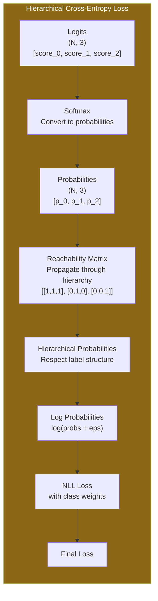

**Purpose**: Respect hierarchical label structure

**Label Hierarchy**:
```
0 (Non-epitope)
  ├─ 1 (CIPS contact - direct binding)
  └─ 2 (BepiPred predicted - indirect/predicted)
```

**Reachability Matrix**:
```python
reachability_matrix = [
    [1, 1, 1],  # Class 0 can reach all classes
    [0, 1, 0],  # Class 1 can only reach itself
    [0, 0, 1]   # Class 2 can only reach itself
]
```

**Loss Calculation**:
```python
# Step 1: Softmax to probabilities
probs = softmax(logits)

# Step 2: Propagate through hierarchy
probs = probs @ reachability_matrix.T

# Step 3: NLL Loss
loss = nll_loss(log(probs + eps), targets, weight=class_weights)
```

**Benefit**: Penalizes predictions that violate hierarchy (e.g., predicting 2 when true is 0)

### 3. MSE Loss (`loss_function='mse'`)

**Regression Loss**:
```python
loss = MSE()(logits.reshape(-1), targets.float())
```

**Usage**: Treats prediction as regression (less common)

---

## Prediction Mechanism

### Inference Process

**Location**: `source_code/model/testing_function.py`

**Step 1: Forward Pass**
```python
model.eval()
with torch.no_grad():
    # Get model predictions
    logits = model(x_struct, x_seq, edge_index, edge_attr,
                  x_antiberty, ab_padding_mask, token_seq, node_size)
    # Shape: (N_residues, 3) for 3 classes
```

**Step 2: Class Prediction**
```python
# Hard prediction (class index)
pred_y = logits.argmax(dim=1)  # Shape: (N_residues,)

# Soft prediction (probabilities)
soft_y = F.softmax(logits, dim=1)  # Shape: (N_residues, 3)
```

**Step 3: Score Calculation**
```python
# Log-odds score
score = log(soft_y / (1 - soft_y + eps))
# Higher score = higher confidence
```

**Step 4: Output Format**
```python
final_df = pd.DataFrame({
    'res_id': resID,           # Residue ID
    'res_name': resShort,      # Amino acid code
    'pred_label': pred_y,      # Predicted class (0, 1, or 2)
    'prob.': soft_y[range(len), pred_y],  # Probability of predicted class
    'score': score[range(len), pred_y]    # Log-odds score
})
```

### Prediction Output

**File**: `{pdb_id}_final_result.txt`

**Format** (tab-separated):
```
res_id    res_name    pred_label    prob.    score
1         A           0             0.85     1.73
2         L           1             0.72     0.94
3         K           0             0.91     2.31
...
```

**Interpretation**:
- **pred_label=0**: Non-epitope
- **pred_label=1**: CIPS contact (direct binding)
- **pred_label=2**: BepiPred predicted (indirect/predicted epitope)
- **prob.**: Confidence in prediction (0-1)
- **score**: Log-odds (higher = more confident)

### Evaluation Metrics

**Location**: `source_code/model/testing_function.py`

**Metrics Calculated**:
1. **Recall** (Macro average)
2. **Precision** (Macro average)
3. **F1 Score** (Macro average)
4. **Accuracy**
5. **ROC AUC** (Macro average, multi-class)
6. **Average Precision** (Micro average)

**Two Evaluation Modes**:
- **All Classes**: Evaluate 0 vs 1 vs 2
- **CIPS Only**: Evaluate 0 vs 1 (binary, CIPS contact vs non-contact)

---

## Data Flow Through the Model

### Complete Forward Pass

```
1. INPUT PREPARATION
   ├─ x_struct: Structural features (N, struct_dim)
   ├─ x_seq: Sequence string or embeddings (N, seq_dim)
   ├─ x_antiberty: AntiBERTy embeddings (M_ab, 512)
   ├─ token_seq: VH/VL tokens
   ├─ edge_index: Graph edges (2, E)
   └─ edge_attr: Edge attributes (E, 3) [dist, charge, lj]

2. INITIAL PROCESS (Feature Fusion)
   ├─ Process sequence: Pretrained model → embeddings
   ├─ Process antibody: AntiBERTy → feed-forward → expand
   ├─ Process tokens: Embedding → expand
   ├─ Optional MHA: Antigen-antibody attention
   └─ Concatenate: x = [x_struct, x_seq, x_antiberty, tokens]
      Output: x (N, in_feature)

3. EDGE ATTRIBUTE PROCESSING
   ├─ attribute_layer: Linear(3, 1) → scalar edge weights
   │  ⚠️ LEARNABLE if gradient_attribute=True
   │  ⚠️ FIXED if gradient_attribute=False
   └─ atb = attribute_layer(edge_attr).clamp(0)
      ⚠️ atb is applied to EDGES (not nodes)
      ⚠️ Controls message passing strength between nodes

4. GNN LAYERS (num_layers)
   For each layer:
   ├─ Optional: Deep-shallow edge filtering
   ├─ Optional: Edge dropout
   ├─ GNN Block:
   │  ├─ Norm (optional)
   │  ├─ ChebConv(x, edge_index, atb)
   │  │  ⚠️ atb applied to EDGES (message passing strength)
   │  │  ⚠️ NOT applied to nodes/neurons
   │  ├─ LeakyReLU + Dropout
   │  ├─ GATConv(x, edge_index, atb)  [if ChebGat block]
   │  │  ⚠️ atb used as edge weights in attention
   │  ├─ LeakyReLU + Dropout
   │  └─ Residual: x = Linear(x_prev) + x_graph
   └─ Output: x (N, hidden_channel)

5. OUTPUT LAYER
   ├─ Optional: Final normalization
   ├─ GNNNaive: GATConv(x, edge_index, atb) → (N, out_label)
   └─ GNNResNet: Linear(x) → (N, out_label)
      Output: logits (N, 3)

6. PREDICTION
   ├─ pred_y = argmax(logits, dim=1)
   ├─ soft_y = softmax(logits, dim=1)
   └─ score = log(soft_y / (1 - soft_y))
```

### Key Dimensions

- **N**: Number of antigen residues (varies per PDB)
- **E**: Number of edges (varies per PDB)
- **M_ab**: Total antibody CDR length (sum of all CDRs)
- **in_feature**: Input feature dimension (sum of enabled features)
- **hidden_channel**: Hidden layer dimension(s) (list)
- **out_label**: Output classes (3: 0, 1, 2)

### Memory Considerations

**Batch Processing**:
- Each PDB is a separate graph
- Batched via `DataLoader` from PyTorch Geometric
- `node_size` tracks number of residues per PDB in batch

**GPU Memory**:
- Pretrained models (ESM2, ProtBERT) are memory-intensive
- AntiBERTy embeddings are cached
- Edge dropout reduces memory during training

---

## Summary

**Epi4Ab Architecture**:
1. **Feature Fusion**: Combines sequence (pretrained), structure, antibody (AntiBERTy), and tokens
2. **Graph Neural Network**: ChebConv + GAT with ResNet skip connections
3. **Attention**: Multi-head attention between antigen and antibody features
4. **Training**: Cross-entropy or hierarchical cross-entropy loss
5. **Prediction**: 3-class classification (non-epitope, CIPS contact, BepiPred predicted)

**Key Innovations**:
- Multi-modal feature fusion (sequence + structure + antibody)
- Antigen-antibody attention mechanism
- Hierarchical loss function respecting label structure
- Deep-shallow architecture for surface-focused learning

---

*This document provides a complete technical understanding of the Epi4Ab model architecture and training procedure with detailed layer-by-layer diagrams.*
