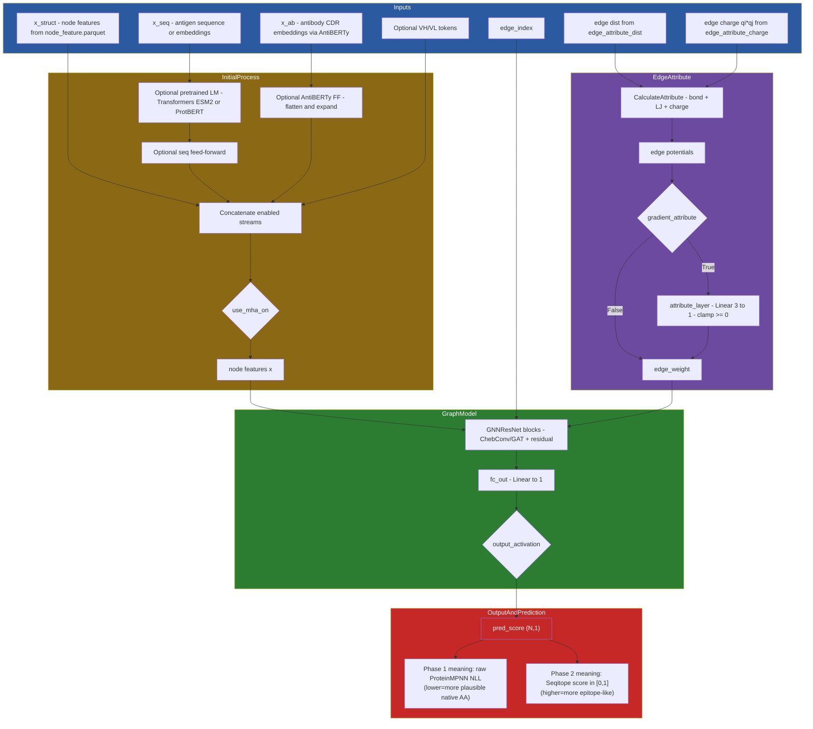

# Epi4Ab -> Seqitope (Regression) Proposal and Current Implementation

This document describes the current plan (and the parts already implemented) to adapt Epi4Ab from its legacy classification workflow to a Seqitope regression workflow.

If you only need run commands, see `docs/PIPELINE_QUICKSTART.md`.

## Executive Summary

- **Phase 1 (implemented):** train a regression model to predict **ProteinMPNN per-residue NLL** (synthetic calibration target). This is *not* epitope learning.
- **Phase 2 (next):** fine-tune the same regression model to predict **Seqitope per-residue score** in `[0,1]` (the real epitope signal).

The point of Phase 1 is de-risking and initialization: verify the end-to-end regression pipeline (graph inputs, residue alignment, MSE training, inference outputs) and optionally warm-start representations before Phase 2.

## What Changed vs Legacy Epi4Ab

Legacy Epi4Ab:
- Classification output (3-class / interface labels) based on `node_label_pi.parquet` / `isInterface`.
- Visualization focused on confusion matrix, F1, etc.

Current Seqitope path:
- Regression output (1 scalar per residue) with `out_label=1`.
- Phase 1 targets: `proteinmpnn_scores.parquet` (`score` = raw ProteinMPNN NLL).
- Phase 2 targets: `node_label_seqitope.parquet` (`score` in `[0,1]`).
- Visualization is regression-first (`scripts/visualize_results.py`).

## Pipeline Overview (Current)

```mermaid
flowchart LR
  A["Metadata CSV"];
  B["Preprocess - gated"];
  C["nodes_edges/pdb_id - node_feature + edges"];
  D["processed_data/pdb_id - lig.pdb + sequences"];
  E["ProteinMPNN scoring"];
  F["nodes_edges/pdb_id - proteinmpnn_scores.parquet"];
  G["Phase 1 Train - regression"];
  H["Phase 1 Model checkpoint"];
  I["Phase 1 Inference - optional"];
  J["test_record - pdb_id_final_result.txt - held-out test only"];
  K["Regression dashboard"];
  L["Phase 2 Fine-tune"];
  M["node_label_seqitope.parquet"];
  N["Phase 2 Model"];

  A --> B;
  B --> C;
  B --> D;
  D --> E;
  E --> F;
  C --> G;
  F --> G;
  G --> H;
  G --> J;
  H --> I;
  I --> J;
  J --> K;
  H --> L;
  M --> L;
  L --> N;

  %% Styling (match EPI4AB_DEEP_DIVE palette)
  style A fill:#2c5aa0,color:#fff
  style B fill:#8b6914,color:#fff
  style C fill:#8b6914,color:#fff
  style D fill:#8b6914,color:#fff
  style E fill:#6b4a9f,color:#fff
  style F fill:#6b4a9f,color:#fff
  style G fill:#2c7d32,color:#fff
  style H fill:#2c7d32,color:#fff
  style I fill:#c62828,color:#fff
  style J fill:#c62828,color:#fff
  style K fill:#c62828,color:#fff
  style L fill:#ad1457,color:#fff
  style M fill:#ad1457,color:#fff
  style N fill:#ad1457,color:#fff
```

Notes on this diagram:
- The training loop writes per-PDB `*_final_result.txt` only for the held-out **test** PDB list.
- To generate `*_final_result.txt` for an arbitrary set of PDBs (e.g., train set or full set), run the inference entrypoint.

## Big Picture Model Architecture (Current)

This is the model computation graph used by both Phase 1 and Phase 2; only the target/activation differ.

Important: the architecture below reflects the *current regression-first* implementation (`out_label=1`).
The legacy classification head (`out_label=3` + softmax) is still supported but is not the primary path.

How this maps to the code:
- Feature assembly (x_struct/x_seq/x_ab) happens in `source_code/data_function/data_function.py`.
- `InitialProcess` logic and MHA conditioning happens in `source_code/model/model_class/initial_process.py`.
- Graph model + head lives in `source_code/model/model_class/graph.py`.

Edge attribute details:
- Distance and charge-product are loaded from parquets, then combined via `source_code/data_function/attribute.py`.
- If `gradient_attribute=True`, the model learns a `Linear(3->1)` edge weighting layer (see `attribute_layer` in `source_code/model/model_class/graph.py`).
- If `gradient_attribute=False`, edge weights are a fixed nonnegative scalar computed from the potentials.

Important switches:
- Phase 1: `output_activation=identity` and `true_score = ProteinMPNN NLL`.
- Phase 2: `output_activation=sigmoid` and `true_score = Seqitope score in [0,1]`.
- Scaling Phase 1 without antibody data: disable AntiBERTy and set `use_mha_on=no` (see `parameters_phase1_proteinmpnn_regression_scale_no_antiberty.txt`).

## Output and prediction details

The network always produces one scalar per residue (`pred_score`). What that number means depends on the phase:

- Phase 1 (ProteinMPNN calibration)
  - `pred_score` is trained to match ProteinMPNN per-residue NLL (raw, not bounded)
  - Use `output_activation=identity`
  - Lower values mean ProteinMPNN considers the native residue more plausible

- Phase 2 (Seqitope fine-tune)
  - `pred_score` is trained to match Seqitope scores in `[0,1]`
  - Use `output_activation=sigmoid`
  - Higher values mean more epitope-like according to Seqitope

Inference output files:
- Per PDB: `test_record/<pdb_id>_final_result.txt`
  - columns include `res_id`, `res_name`, `pred_score`, and `true_score` when available

### Step A: Preprocessing (graphs + gating)

Produces:
- `processed_data/<pdb_id>/...` (antigen-only `lig.pdb`, sequences, and feature intermediates)
- `nodes_edges/<pdb_id>/...` (graph inputs: `node_feature.parquet`, `edge_index.parquet`, `edge_attribute_*.parquet`)

Robustness improvements included:
- Antigen chain auto-detection (`--autodetect_antigen_chain`) to prevent extracting the antibody chain as antigen.
- Gating/quarantine between steps (`scripts/pipeline_gate.py`), producing filtered metadata under `OUT_BASE/gates/...`.

Entry point:
- `slurm/preprocess_full_autodetect.sbatch`

Notes:
- Preprocessing expects a metadata CSV with at least: `pdbID`, `pdb` (4-char code), and `antigen` (chain ID).
- If CDR columns (`H1_seq..L3_seq`) are missing, preprocessing will still write `sequence/cdr_sequence.json` with empty strings.
  - This allows Phase 1 scaling runs that do not require AntiBERTy.

### Step B: Phase 1 targets (ProteinMPNN)

For each PDB, Phase 1 creates:
- `nodes_edges/<pdb_id>/proteinmpnn_scores.parquet`

Format:
- `resId` (int)
- `score` (float) = **ProteinMPNN NLL** for the native amino acid at that residue

Interpretation:
- low NLL: native residue is structurally plausible under ProteinMPNN
- high NLL: native residue is structurally implausible (ProteinMPNN is "surprised")

This value is a **sequence-structure plausibility signal**, not an epitope probability.

Entry point:
- `slurm/proteinmpnn_scores_full_autodetect.sbatch`

### Step C: Phase 1 training (synthetic calibration)

Training configuration:
- `out_label=1`
- `loss_function=mse`
- `target_type=proteinmpnn`
- `target_file=proteinmpnn_scores.parquet`
- `target_column=score`
- `output_activation=identity` (raw regression output, because NLL is not in `[0,1]`)

Entry points:
- Parameters: `parameters_phase1_proteinmpnn_regression.txt`
- SLURM: `slurm/train_phase1_proteinmpnn_regression.sbatch`

Important evaluation note:
- Use a PDB-level train/test split (the training SLURM script generates `pdb_list_train.csv` and `pdb_list_test.csv`).
- Only judge Spearman/MSE/MAE on the held-out test PDBs.

### Step D: Phase 1 inference + regression dashboard

Why: training writes per-PDB `*_final_result.txt` only for the held-out test set.
If you want per-PDB outputs for an arbitrary set of PDBs (e.g., the whole dataset), run inference with the trained model.

Entry points:
- Inference: `slurm/inference_phase1_proteinmpnn_regression.sbatch`
- Visualization: `scripts/visualize_results.py`

Outputs:
- `.../test_record/<pdb_id>_final_result.txt` with `pred_score` and `true_score`
- `.../dashboard.html` (regression plots)
- `.../test_record/regression_summary.csv` (per-PDB summary)

### Step E: Phase 2 (next) - fine-tune on Seqitope

Goal: predict **Seqitope per-residue score** in `[0,1]`.

Labels to produce per PDB:
- `nodes_edges/<pdb_id>/node_label_seqitope.parquet` with:
  - `resId` (int)
  - `score` (float in `[0,1]`)

Phase 2 training configuration:
- `target_type=seqitope`
- `target_file=node_label_seqitope.parquet`
- `target_column=score`
- `output_activation=sigmoid` (now the output is a probability-like score)

Phase 2 planning doc:
- `docs/SEQITOPE_PHASE2_PLAN.md`

## Phase 1 Scaling Mode (no AntiBERTy)

To scale Phase 1 to hundreds/thousands of PDBs without antibody CDR sequences:

- Build metadata from SAbDab summary:
  - `scripts/build_phase1_metadata_from_sabdab.py`
- Download CIFs on a login node:
  - `scripts/download_pdbs_login_node.py --pdb_info_path <csv> --processed_dir <dir>`
- Use the no-AntiBERTy parameters file:
  - `parameters_phase1_proteinmpnn_regression_scale_no_antiberty.txt`

In this mode:
- `use_antiberty` is disabled and `use_mha_on=no`.
- You still use antigen graphs + (optionally) ESM2 embeddings.

## What Phase 1 Proved (and What It Did Not)

Phase 1 proved:
- The end-to-end regression pipeline works with the current Epi4Ab codebase:
  - preprocessing -> per-residue regression targets -> regression training -> regression inference -> per-residue outputs
- Residue alignment via `resId` is consistent through the pipeline.
- Training is stable (loss decreases; no NaNs; outputs are generated).

Phase 1 did NOT prove:
- Epitope prediction accuracy.
- Biological relationship between ProteinMPNN NLL and antibody binding.

Phase 2 is the first point where we can measure whether the model predicts the real Seqitope target.

## How To Run (Reference)

Use the runbook:
- `docs/PIPELINE_QUICKSTART.md`

Key SLURM entrypoints:
- Preprocess (gated): `slurm/preprocess_full_autodetect.sbatch`
- ProteinMPNN targets (gated): `slurm/proteinmpnn_scores_full_autodetect.sbatch`
- Phase 1 train: `slurm/train_phase1_proteinmpnn_regression.sbatch`
- Phase 1 inference: `slurm/inference_phase1_proteinmpnn_regression.sbatch`

## Notes on ESM2 / use_pretrained

If `use_pretrained` is enabled, ESM2 weights are loaded via HuggingFace Transformers at runtime.
Compute nodes are offline; weights must be cached ahead of time (see `docs/PHASE1_REGRESSION_PIPELINE.md`).

## Containerization Note

Leonardo compute nodes typically do not run Docker. If a container is required, use Apptainer/Singularity.
