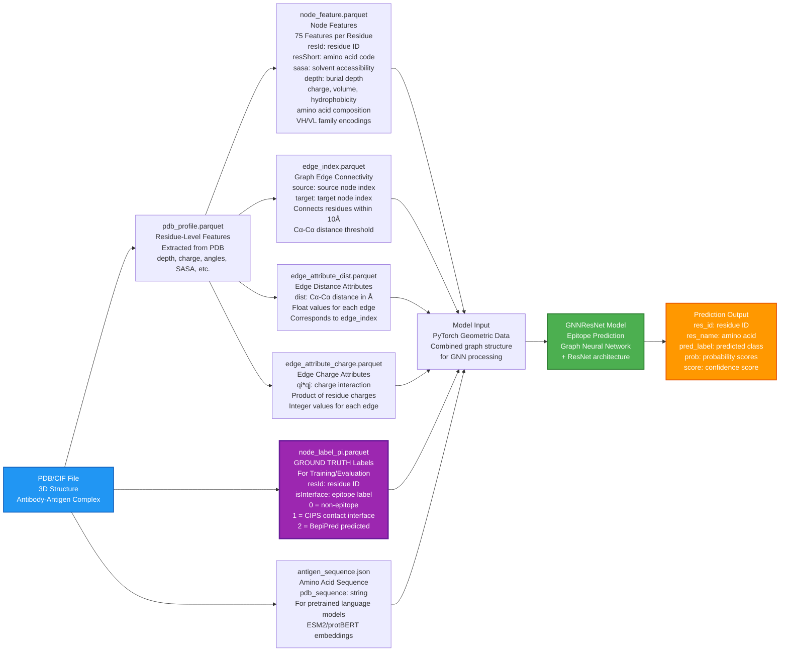
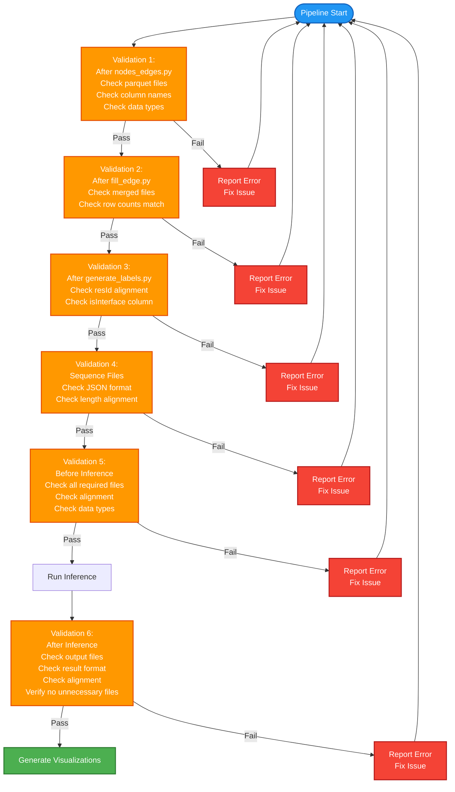
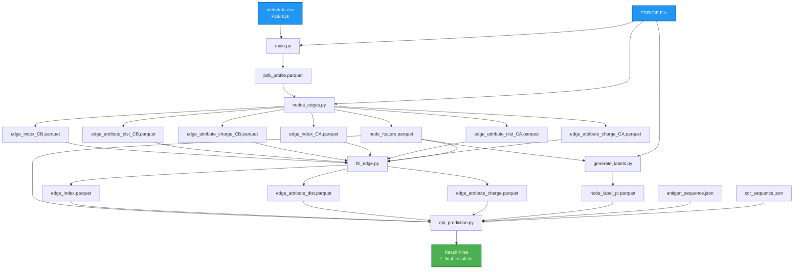

# Legacy classification pipeline

**Status:** archival. For current regression/DASA work use [PIPELINE_QUICKSTART.md](PIPELINE_QUICKSTART.md).

This document describes the **original Epi4Ab classification pipeline**:

- Labels: `node_label_pi.parquet` with `isInterface` ∈ `{0, 1, 2}` (categorical, not continuous 0–1 scores)
- Loss: `cross_entropy`
- Scripts: `run_training.sh`, `generate_labels.py`, `inference_test3A.sbatch`, etc.

---

# Epi4Ab Pipeline Documentation (legacy body)

Complete documentation of the Epi4Ab preprocessing and inference pipeline, including workflows for both the test3A dataset (20 PDBs) and the EpiScan dataset.

## Table of Contents

1. [Overview](#overview)
2. [Test3A Dataset Pipeline (20 PDBs)](#test3a-dataset-pipeline-20-pdbs)
3. [EpiScan Dataset Pipeline](#episcan-dataset-pipeline)
4. [Data Flow: From PDB to Model Input](#data-flow-from-pdb-to-model-input)
5. [Validation Checkpoints](#validation-checkpoints)
6. [File Dependencies](#file-dependencies)
7. [Step-by-Step Instructions](#step-by-step-instructions)
8. [Troubleshooting](#troubleshooting)

## Overview

The Epi4Ab pipeline processes antibody-antigen complex structures to predict epitope regions. The pipeline consists of several stages:

1. **Data Preparation**: Download/extract PDB structures
2. **Preprocessing**: Extract features, generate graph structure
3. **Label Generation**: Create ground truth epitope labels
4. **Inference**: Run trained model to predict epitopes
5. **Visualization**: Generate interactive dashboards

Each stage includes validation checkpoints to ensure data integrity and alignment.

For regression outputs, `scripts/visualize_results.py` generates regression plots (not confusion matrices).

## Test3A Dataset Pipeline (20 PDBs)

The test3A dataset consists of 20 experimental antibody-antigen complexes from the RCSB PDB database.

### Pipeline Flow



```mermaid
flowchart TD
    Start([Start: Test3A Dataset<br>20 PDBs]) --> Download[Download PDB Files<br>from RCSB PDB]
    Download --> Extract["Extract antigen chain<br>create lig.pdb"]
    Extract --> ChainQC["Chain QC (optional)<br>auto-detect antigen chain"]
    ChainQC --> Preprocess1[Preprocess Step 1:<br>main.py<br>Generate pdb_profile.parquet]
    
    Preprocess1 --> NodesEdgesCB[nodes_edges.py CB<br/>Generate:<br/>- node_feature.parquet<br/>- edge_index_CB.parquet<br/>- edge_attribute_dist_CB.parquet<br/>- edge_attribute_charge_CB.parquet]
    
    NodesEdgesCB --> NodesEdgesCA[nodes_edges.py CA<br/>Generate:<br/>- edge_index_CA.parquet<br/>- edge_attribute_dist_CA.parquet<br/>- edge_attribute_charge_CA.parquet]
    
    NodesEdgesCA --> FillEdge[fill_edge.py<br/>Merge CA/CB edges<br/>Generate:<br/>- edge_index.parquet<br/>- edge_attribute_dist.parquet<br/>- edge_attribute_charge.parquet]
    
    FillEdge --> GenerateLabels[generate_labels.py<br/>Generate:<br/>- node_label_pi.parquet<br/>with resId + isInterface]
    
    GenerateLabels --> ValidatePreprocess[Validate Preprocessing<br/>Check file formats<br/>Check alignment]
    
    ValidatePreprocess --> Inference[epi_prediction.py<br/>Run Model Inference<br/>Generate predictions]
    
    Inference --> ValidateInference[Validate Inference Outputs<br/>Check result files<br/>Verify alignment]
    
    ValidateInference --> IndividualViz[Generate Individual PDB Visualizations<br/>visualize_results.py<br/>Create per-PDB HTML files]
    
    IndividualViz --> Dashboard[Generate Dashboard<br/>visualize_results.py<br/>Create compiled HTML dashboard]
    
    Dashboard --> End([End: Results Dashboard<br/>+ Individual PDB Visualizations])
    
    style Start fill:#2196F3,stroke:#1565C0,stroke-width:2px,color:#fff
    style End fill:#4CAF50,stroke:#2E7D32,stroke-width:2px,color:#fff
    style ChainQC fill:#F44336,stroke:#B71C1C,stroke-width:2px,color:#fff
    style ValidatePreprocess fill:#FF9800,stroke:#E65100,stroke-width:2px,color:#fff
    style ValidateInference fill:#FF9800,stroke:#E65100,stroke-width:2px,color:#fff
```

### Key Steps

1. **Download PDB Files**: Download structures from RCSB PDB using PDB IDs
2. **Extract Antigen Chain**: Extract antigen chain into `lig.pdb` (antigen-only)
3. **Preprocess (main.py)**: Generate `pdb_profile.parquet` with residue-level features
4. **Create Nodes/Edges (CB)**: Generate graph structure using Cβ atoms
5. **Create Nodes/Edges (CA)**: Generate graph structure using Cα atoms
6. **Fill Edges**: Merge CA and CB edges to create final graph
7. **Generate Labels**: Create ground truth epitope labels (CIPS + BepiPred)
8. **Run Inference**: Predict epitopes using trained GNNResNet model
9. **Generate Visualizations**: Create interactive HTML dashboards

### File Locations

- **Preprocessed Data**: `/leonardo_scratch/fast/EUHPC_D29_035/epi4ab/upstream_preprocess/processed_data/`
- **Nodes/Edges**: `/leonardo_scratch/fast/EUHPC_D29_035/epi4ab/upstream_preprocess/nodes_edges/`
- **Inference Output**: `/leonardo_work/EUHPC_D29_035/Epi4Ab/output_inference/`

## EpiScan Dataset Pipeline

The EpiScan dataset consists of 3 antibody-antigen complexes, some requiring structure prediction.

### Pipeline Flow



```mermaid
flowchart TD
    Start([Start: EpiScan Dataset<br/>3 Complexes]) --> CheckPDB{Check for<br/>Experimental PDBs}
    
    CheckPDB -->|Found| UsePDB[Use Experimental PDB<br/>e.g., 6zxn for Ty1+RBD]
    CheckPDB -->|Not Found| Predict[Predict Structure<br/>ESMFold for Antibody]
    
    Predict --> Dock[Dock to Antigen<br/>HDOCK or Similar<br/>Create Complex PDB]
    
    UsePDB --> Extract[Extract Chains<br/>Antigen + Antibody]
    Dock --> Extract
    
    Extract --> Preprocess1[Preprocess Step 1:<br/>main.py<br/>Generate pdb_profile.parquet<br/>SKIPPED if already done]
    
    Preprocess1 --> NodesEdgesCB[nodes_edges.py CB<br/>Generate:<br/>- node_feature.parquet<br/>- edge_index_CB.parquet<br/>- edge_attribute_dist_CB.parquet<br/>- edge_attribute_charge_CB.parquet]
    
    NodesEdgesCB --> NodesEdgesCA[nodes_edges.py CA<br/>Generate:<br/>- edge_index_CA.parquet<br/>- edge_attribute_dist_CA.parquet<br/>- edge_attribute_charge_CA.parquet]
    
    NodesEdgesCA --> FillEdge[fill_edge.py<br/>Merge CA/CB edges<br/>Generate:<br/>- edge_index.parquet<br/>- edge_attribute_dist.parquet<br/>- edge_attribute_charge.parquet]
    
    FillEdge --> GenerateLabels[generate_cips_labels.py<br/>Generate:<br/>- node_label_pi.parquet<br/>with resId + isInterface<br/>CIPS labels only]
    
    GenerateLabels --> ValidatePreprocess[Validate Preprocessing<br/>Check file formats<br/>Check alignment<br/>Verify resId + isInterface]
    
    ValidatePreprocess --> Inference[epi_prediction.py<br/>Run Model Inference<br/>Generate predictions]
    
    Inference --> ValidateInference[Validate Inference Outputs<br/>Check result files<br/>Verify alignment<br/>Verify no unnecessary files]
    
    ValidateInference --> IndividualViz[Generate Individual PDB Visualizations<br/>visualize_results.py<br/>Create per-PDB HTML files]
    
    IndividualViz --> Dashboard[Generate Dashboard<br/>visualize_results.py<br/>Create compiled HTML dashboard]
    
    Dashboard --> End([End: Results Dashboard<br/>+ Individual PDB Visualizations])
    
    style Start fill:#2196F3,stroke:#1565C0,stroke-width:2px,color:#fff
    style End fill:#4CAF50,stroke:#2E7D32,stroke-width:2px,color:#fff
    style CheckPDB fill:#FF5722,stroke:#BF360C,stroke-width:2px,color:#fff
    style Predict fill:#FF5722,stroke:#BF360C,stroke-width:2px,color:#fff
    style ValidatePreprocess fill:#FF9800,stroke:#E65100,stroke-width:2px,color:#fff
    style ValidateInference fill:#FF9800,stroke:#E65100,stroke-width:2px,color:#fff
```

### Key Differences from Test3A

1. **Structure Prediction**: Some complexes require ESMFold prediction for antibody structures
2. **Docking**: Predicted antibodies are docked to antigens using HDOCK
3. **CIPS Labels Only**: Labels generated using CIPS (Contact Interface Prediction Server) only, no BepiPred
4. **Custom Scripts**: Uses `generate_cips_labels.py` instead of `generate_labels.py`

### File Locations

- **Preprocessed Data**: `/leonardo_scratch/fast/EUHPC_D29_035/epi4ab/episcan_preprocess/processed_data/`
- **Nodes/Edges**: `/leonardo_scratch/fast/EUHPC_D29_035/epi4ab/episcan_preprocess/nodes_edges/`
- **Inference Output**: `/leonardo_work/EUHPC_D29_035/Epi4Ab/output_inference/`

## Data Flow: From PDB to Model Input

This diagram shows how raw PDB files are transformed into model inputs.



### Data Files

1. **pdb_profile.parquet**: Intermediate residue-level features extracted from PDB structure
   - Contains: depth, charge, dihedral angles, SASA, amino acid profiles
   - Generated by `main.py` preprocessing step
   - Used as input for generating node features and edges

2. **node_feature.parquet**: Node features for graph neural network (75 features per residue)
   - **resId**: Residue ID (integer identifier)
   - **resShort**: Amino acid three-letter code (e.g., "ALA", "GLY")
   - **Structural features**: SASA (solvent accessible surface area), depth (burial depth), dihedral angles (phi, psi, omega)
   - **Chemical features**: Charge (from PDB2PQR), volume, hydrophobicity (Kyte-Doolittle)
   - **Compositional features**: Amino acid composition, charge composition
   - **Antibody-specific features**: VH/VL family one-hot encodings (for antibody-antigen context)
   - Generated from `pdb_profile.parquet` by `nodes_edges.py`

3. **edge_index.parquet**: Graph edge connectivity (defines which residues are connected)
   - **source**: Source node index (0-based, corresponds to row in node_feature)
   - **target**: Target node index (0-based, corresponds to row in node_feature)
   - Edges connect residues within 10Å Cα-Cα distance threshold
   - Merged from both CA (Cα) and CB (Cβ) atom types for comprehensive connectivity
   - Generated by `nodes_edges.py` and merged by `fill_edge.py`

4. **edge_attribute_dist.parquet**: Edge distance attributes
   - **dist**: Cα-Cα distance in Angstroms (float)
   - One value per edge, corresponds to edge_index pairs
   - Used as edge features in the graph neural network

5. **edge_attribute_charge.parquet**: Edge charge interaction attributes
   - **qi*qj**: Product of residue charges (integer)
   - Charge interaction strength between connected residues
   - One value per edge, corresponds to edge_index pairs

6. **node_label_pi.parquet**: **GROUND TRUTH labels** for training and evaluation
   - **resId**: Residue ID (must align with node_feature.parquet)
   - **isInterface**: Epitope label (integer)
     - **0** = Non-epitope (not an epitope residue)
     - **1** = CIPS contact interface (antigen residue within 5Å of antibody atoms)
     - **2** = BepiPred predicted epitope (IEDB BepiPred 2.0 score ≥ 0.5)
   - **Important**: Labels are aligned to node_feature.parquet resIds to ensure proper training/evaluation
   - Generated by `generate_labels.py` (or `generate_cips_labels.py` for EpiScan dataset)

7. **antigen_sequence.json**: Amino acid sequence for pretrained language models
   - **pdb_sequence**: String of amino acid codes (e.g., "MKTAYIAKQR...")
   - Used for generating ESM2/protBERT embeddings when pretrained models are enabled
   - Extracted from antigen chain sequence

## Validation Checkpoints

Validation occurs at multiple checkpoints throughout the pipeline.



### Validation Details

**Validation 1 (nodes_edges.py)**:
- File existence and readability
- Required columns present
- Data types correct
- Edge indices within valid range
- No NaN values in critical columns

**Validation 2 (fill_edge.py)**:
- Merged files exist
- Row counts match across edge files
- Edge indices valid

**Validation 3 (generate_labels.py)**:
- resId alignment with node_feature
- isInterface column present and correct type
- Label values in {0, 1, 2}

**Validation 4 (Sequence Files)**:
- JSON format valid
- Required keys present
- Sequence length matches node_feature

**Validation 5 (Inference Inputs)**:
- All required files exist (based on config)
- File formats correct
- Alignment verified

**Validation 6 (Inference Outputs)**:
- Result files exist for all PDBs
- Result format correct
- Alignment with node_feature verified
- No unnecessary files required

## File Dependencies

This diagram shows the dependency relationships between files.



## Step-by-Step Instructions

### For Test3A Dataset

1. **Preprocess**:
   ```bash
   sbatch slurm/preprocess_test3A.sbatch
   ```

2. **Generate Labels**:
   ```bash
   sbatch slurm/generate_labels.sbatch
   ```

3. **Run Inference**:
   ```bash
   sbatch slurm/inference_test3A.sbatch
   ```

4. **Generate Visualizations**:
   ```bash
   ./scripts/generate_dashboard.sh output_inference/<timestamp>_<model>/test_record
   ```
   This generates:
   - Individual PDB visualization files first (in `visualizations/` directory)
   - Then the compiled dashboard (`dashboard.html`) with links to individual files

### For EpiScan Dataset

1. **Prepare Structures** (if needed):
   - Download experimental PDBs or predict with ESMFold
   - Dock predicted antibodies to antigens

2. **Preprocess**:
   ```bash
   sbatch slurm/preprocess_episcan.sbatch
   ```

3. **Generate Labels**:
   ```bash
   sbatch slurm/generate_labels_episcan.sbatch
   ```

4. **Run Inference**:
   ```bash
   sbatch slurm/inference_episcan.sbatch
   ```

5. **Generate Visualizations**:
   ```bash
   ./scripts/generate_dashboard.sh output_inference/<timestamp>_<model>/test_record
   ```
   This generates:
   - Individual PDB visualization files first (in `visualizations/` directory)
   - Then the compiled dashboard (`dashboard.html`) with links to individual files

## Troubleshooting

### Common Issues

1. **Label Format Mismatch**
   - **Error**: `AttributeError: 'DataFrame' object has no attribute 'isInterface'`
   - **Solution**: Ensure `node_label_pi.parquet` has columns `resId` and `isInterface`, not `label`
   - **Fix**: Regenerate labels using `generate_labels.py` or `generate_cips_labels.py`

2. **Sequence Length Mismatch**
   - **Error**: `AssertionError: size of x_seq X different with Y`
   - **Solution**: Regenerate `antigen_sequence.json` from `node_feature.parquet` resShort column
   - **Fix**: Extract sequence directly from node features

3. **Missing Files**
   - **Error**: `FileNotFoundError: node_feature.parquet`
   - **Solution**: Run preprocessing steps in order
   - **Fix**: Ensure all preprocessing steps completed successfully

4. **Edge Index Out of Range**
   - **Error**: Edge indices reference non-existent nodes
   - **Solution**: Check that edge indices are within [0, len(node_feature)-1]
   - **Fix**: Regenerate edges using `nodes_edges.py`

5. **Alignment Issues**
    - **Error**: resId mismatch between files
    - **Solution**: Ensure all files use same residue IDs from same chain
    - **Fix**: Regenerate files from same source, verify chain selection

6. **Antigen Chain Mis-specified (Graph Built on Antibody Chain)**
    - **Symptom**: `node_feature.parquet` sequence looks like antibody variable domain (e.g., starts with `QVQL` or `DIQMT`)
    - **Root cause**: metadata `antigen` chain is incorrect → `lig.pdb` extracted from the wrong chain
    - **Impact**: graph nodes represent an antibody chain, so ProteinMPNN targets / epitope labels become inconsistent
    - **Fix**: correct antigen chain in metadata OR enable `--autodetect_antigen_chain` during preprocessing

### Validation Commands

Run validation at any step:

```bash
# Validate all steps for a PDB
python scripts/validate_pipeline.py \
    --pdb_id 4ywg_HLG \
    --nodes_edges_dir /path/to/nodes_edges \
    --step all

# Validate inference outputs
python scripts/validate_pipeline.py \
    --output_dir output_inference/2025-12-18_GNNResNet_1 \
    --inference_list inference_list_test3A.csv \
    --nodes_edges_dir /path/to/nodes_edges \
    --step inference_outputs

# Validate all PDBs from metadata
python scripts/validate_pipeline.py \
    --metadata metadata.csv \
    --nodes_edges_dir /path/to/nodes_edges \
    --step labels

# Validate regression targets (Seqitope/ProteinMPNN)
python scripts/validate_pipeline.py \
    --metadata metadata.csv \
    --nodes_edges_dir /path/to/nodes_edges \
    --step labels \
    --target_type seqitope \
    --target_file node_label_seqitope.parquet \
    --target_column score
```

### ProteinMPNN Calibration Targets

Phase 1 uses ProteinMPNN scores as regression targets.

**Target format (per PDB):**
- `nodes_edges/<PDB>/proteinmpnn_scores.parquet`
- Columns: `resId` (int), `score` (float)

**Scoring workflow (offline compute):**
1. Install ProteinMPNN on login node at `/leonardo_work/EUHPC_D29_035/Epi4Ab/tools/proteinmpnn`.
2. Create a manifest CSV with columns: `pdb_id`, `pdb_path`, `chain_id`.
3. Run the wrapper:

```bash
sbatch slurm/proteinmpnn_scores.sbatch
```

**Convert TSV -> parquet (per PDB):**

```bash
python scripts/prepare_proteinmpnn_scores.py \
    --pdb_id <PDB_ID> \
    --nodes_edges_dir /path/to/nodes_edges \
    --scores_file /path/to/<PDB_ID>_proteinmpnn.tsv \
    --res_id_col resId \
    --score_col score \
    --chain_id <ANTIGEN_CHAIN>
```

### Getting Help

- Check validation output for specific error messages
- Review log files in `logs/` directory
- Verify file formats match expected structure
- Ensure all dependencies are installed

### Seqitope Label File Schema (Phase 2)
- File: `nodes_edges/<pdb_id>/node_label_seqitope.parquet`
- Columns: `resId:int`, `score:float` in `[0,1]`
- Alignment: `resId` must match `node_feature.parquet:resId` 1:1 and order-preserving.

Validation command:
```bash
python scripts/validate_pipeline.py   --pdb_id <pdb_id>   --nodes_edges_dir <OUT_BASE>/nodes_edges   --step labels   --target_type seqitope   --target_file node_label_seqitope.parquet   --target_column score
```
